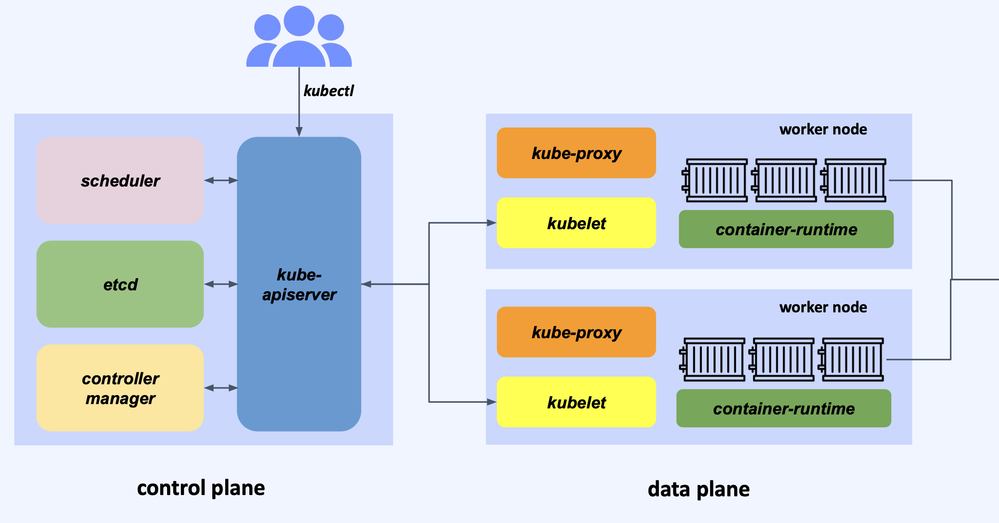

## Architecture


### etcd
- 쿠버네티스에서 필요한 모든 데이터를 키-값 형태로 저장하는 데이터베이스
- etcd가 다운되면 모든 컴포넌트가 미아가 되기 때문에 가용성이 매우 중요
- 클러스터링하여 분산 실행하는 RSM(Replicated State Machine) 구조

```shell
# etcd pod 상세 확인
$ k describe pod etcd-minikube -n kube-system
```

### kube-apiserver
- 쿠버네티스 API를 제공하는 핵심 구성 요소
- 쿠버네티스 프론트앤드로서 클러스터로 온 요청의 유효성 검증
- 다른 컴포넌트 간 통신을 중재
- kubectl 유틸리티가 접근하는 주체

### kube-scheduler
- 클러스터 안에서 자원 할당이 가능한 노드 중 알맞은 노드를 선택하는 역할
- Label / Selector / Affinity / Taint / Toleration 기능과 함께 동작
- pod 스케줄링 분류
  - 사용자가 특정 노드에 pod를 배치하고 싶을 때
    - nodeSelector
    - Node Affinity
    - Node Anti-Affinity
    - Inter Pod Affinity
    - Inter Pod Anti-Affinity
  - 관리자가 특정 노드에는 pod가 배치되는 것을 막고 싶을 때
    - Taints
    - Tolerations


  **Taints and Toleration**
  - 어떤 pod가 어떤 node에 스케줄링 될 수 있는지를 제한
  - **Taints** : node가 가지게 되는 성격(ex . taint: blue)
  - **Toleration** : pod가 가지게 되는 taint에 대한 toleration(ex . toleration: blue)

  **Labels and Selector(Affinity)**

  https://kubernetes.io/docs/concepts/scheduling-eviction/assign-pod-node/

  - NodeSelector
    - node에는 label을 할당하고, pod에는 nodeSelector 필드를 추가하여 특정 node에서 구동되도록 함
    - 다만, NodeSelector는 여러 값을 할당하거나 Not 예외처리를 하거나 하는 등을 하기는 어려움
  - NodeAffinity
    - 여러 advanced 할당을 할 수 있는 만큼 문법이 다소 복잡
```shell
# Node
$ kubectl label nodes node01 size=Large
```

```yaml
# Pod
apiVersion: v1
kind: Pod
metadata:
  name: app-pod
spec:
  containers:
  - name: nginx
    image: nginx
  nodeSelector:
    size: Large
```

```yaml
# Pod
apiVersion: v1
kind: pod
metadata:
  name: app-pod
spec:
  containers:
  - name: nginx
    image: nginx
  affinity:
    nodeAffinity:
      requiredDuringSchedulingIgnoreDuringExecution:
        nodeSelectorTerms:
        - matchExpressions:
          - key: size
            operator: In(|NotIn|Exists)
            value:
            - Large
            - Medium 
```

### kube-controller-manager
https://kubernetes.io/docs/reference/command-line-tools-reference/kube-controller-manager/
- 다양한 controller를 실행하는 구성 요소
- node controller / job controller / endpoint controller / replication controller 등 각 오브젝트를 관할
```shell
# check kube-controller-manager pod detail
$ k describe pod kube-controller-manager-minikube -n kube-system
```
- controller 동작 예시
  - 노드에 문제가 생겼을때의 node controller 동작
    - 5s 마다 status check를 하다가 (node monitor period)
    - heartbeat 가 도착하지 않으면 40s를 대기하고 unreachable로 마킹하고 (node monitor grace period)
    - 추가로 5m을 더 대기 (pod eviction timeout)
    - 복구되지 않으면 해당 node의 pod들을 정상 node로 재배포 (pod가 replica set에 해당하는 경우)

### cloud-controller-manager
- 쿠버네티스의 컨트롤러들을 클라우드 서비스 API와 연결해서 관리하는 컴포넌트
- CSP에 특화된 컨트롤러만을 관리
- 따라서 on prem환경인 경우 이 컴포넌트는 없음
