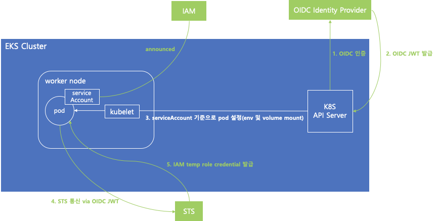

### IRSA(IAM Role for Service Account)
- OpenID Connector(OIDC) Identity Provider와 STS를 활용하여 쿠버네티스의 Service Account에 IAM Role을 할당할 수 있게 하는방식



#### Practice

```shell
# Create Cluster
$ eksctl create cluster my-cluster
# Create IAM Identity provider
$ eksctl utils associate-iam-oidc-provider --region=ap-northeast-2 --cluster=my-cluster --approve
# Create IAM Role and ServiceAccount
$ eksctl create iamserviceaccount --cluster=my-cluster --name=test-role --attach-policy-arn=arn:aws:iam:aws:policy//AmazonS3FullAccess --approve
```

- Deploy Pod

```yaml
apiVersion: apps/v1
kind: Deployment
metadata:
  name: pod-a
spec:
  replicas: 1
  selector:
    matchLabels:
      app: pod-a
  template:
    metadata:
      labels:
        app: pod-a
    spec:
      containers:
        - name: ubuntu
          image: ubuntu:latest
          imagePullPolicy: Always
          command: [ "/bin/bash", "-c", "--" ]
          args: [ "while true; do sleep 30; done;" ]
      serviceAccountName: test-role
      nodeSelector:
        kubernetes.io/hostname: ip-192-168-59-173.ap-northeast-2.compute.internal
```

```yaml
apiVersion: apps/v1
kind: Deployment
metadata:
  name: pod-b
spec:
  replicas: 1
  selector:
    matchLabels:
      app: pod-b
  template:
    metadata:
      labels:
        app: pod-b
    spec:
      containers:
        - name: ubuntu
          image: ubuntu:latest
          imagePullPolicy: Always
          command: [ "/bin/bash", "-c", "--" ]
          args: [ "while true; do sleep 30; done;" ]
      nodeSelector:
        kubernetes.io/hostname: ip-192-168-59-173.ap-northeast-2.compute.internal
```

- Check role
```shell
$ kebectl get po -o wide
$ aws s3 ls | wc -l 12
```
